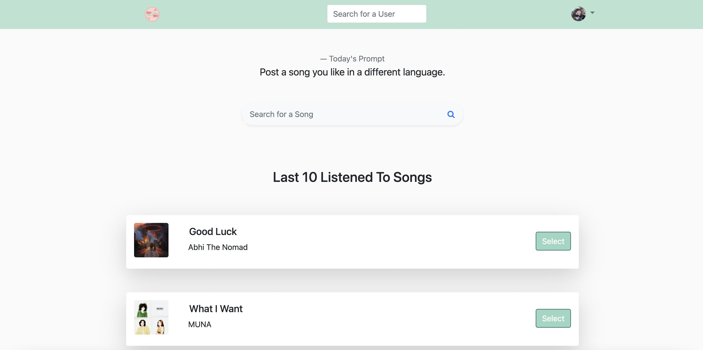
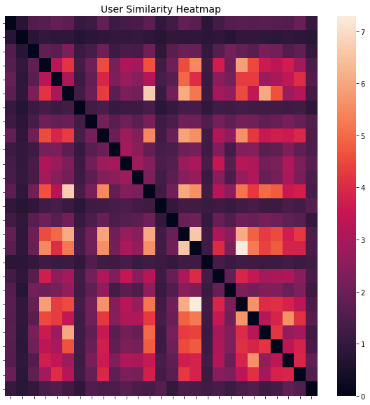

# Ay-Yo! User Similarity

## Introduction
A few months ago, we created a music-sharing social media called Ay-Yo!, which encourages users to post a song every day. To improve functionality for our social media, we began thinking of ways to connect similar users. Any good social media has an algorithm to recommend similar users that one might enjoy following. Rather than using traditional matrix factorization, we wanted to explore if we could determine how similar users' tastes in music are by applying Natural Language Processing to the songs they have posted. 

## Algorithm Overview
In order to calculate user similarity, we need some way to numerically represent a user's taste in music. The only data we have for users is the title of the songs that they have posted. Our process was:
1. pull lyrics for each song a user has posted
2. tokenize song lyrics
3. obtain vector representation of song by taking average of token embeddings
4. obtain vector representation of user by taking average of embeddings of songs they have posted
5. compute similarity between users by taking Euclidean distance of their user vectors

## Data Collection
Our main data sources were the Ay-Yo! database hosted on AWS DynamoDB, which we connected to via boto3, and the Genius API, which we connected to via the lyricalgenius Python package. We used the Ay-Yo! database to collect the names of each song posted by each user, and the Genius API to collect the associated lyrics for each song. 

## Preprocessing

### Tokenization
To improve our similarity metric, we tried various different tokenization techniques. We tried a custom tokenization that attempted to transform song lyrics into individual words, as well as a pretrained sub word tokenizer. Different tokenization techniques gave us different similarity scores, but the rank order of similar users remained the same. We chose to use the pretrained Bert tokenizer, as it showed us the greatest difference in the similarity score between two similar artists and the similarity score between two non-similar artists. 

### Embeddings
We also tried various word embedding techniques. Because our dataset was small (Ay-Yo! only has about 20 users, each of whom have posted between 1 and 30 times), we used transfer learning with pretrained embeddings. No point in reinventing the wheel, especially when we have access to a Mercedes in the form of GloVe embeddings. The GloVe embeddings have been trained on an extremely large corpus of text, thus they are better than any word embedding we could train ourselves. We tried embeddings trained on different corpuses, including Wikipedia and Twitter. Again, the different embeddings gave different similarity metrics, but the rankings remained the same, so we chose the embedding which gave us the greatest variation in similarity scores for similar artists and non-similar artists, which was the GloVe embedding trained on the Wikipedia corpus. It is interesting to note that both the tokenizer and embeddings we deemed most suited to our task were both trained on Wikipedia text. 

## Analysis
By applying tokenization and embedding, we obtained a vector representation of each token ($\vec x_i$) in a song. We then took the average of the vector representations of each token to represent the song.

$$\vec v_{\text{song}} = \frac1n \sum_{i=1}^n \vec x_i$$

We then took the average of the representation of each song posted by a user to represent the users. 

$$\vec u_{\text{marti}} = \frac1n \sum_{i=1}^n \vec v_i$$

Finally, we computed the similarity score between user representations.

$$\text {similarity score = }\frac 1 {\lVert \vec u_i - \vec u_j \rVert}$$

## Results
Generally, the results from our investigation were encouraging! This was inherently an unsupervised task, as we were unable to label or validate that users are similar. However, we still found some interesting insights.

## Sources/Dependencies
- Ay-Yo! Homepage: https://ay-yo.click
- Lyricalgenius package: https://pypi.org/project/lyricsgenius/
- GloVe 6B 300d embeddings: https://www.kaggle.com/datasets/thanakomsn/glove6b300dtxt
